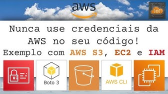

# Repositório do canal do Youtube VPC Dot Code  

Este repositório é exclusivamente voltado para compartilhar códigos usados nos exemplos mostrados em vídeos do canal do Youtube [@vpcdotcode](https://www.youtube.com/@vpcdotcode).

## Recebendo, Processando e Salvando Emails na AWS com S3, SES e Lambda

- [**Código**](https://github.com/ricardoteix/vpcdotcode_youtube_repo/tree/master/ses-email-receiving)
- [**Vídeo**](https://www.youtube.com/watch?v=DuouLiak9lY)

## Acessando EC2 privadas com EC2 Instance Connect Endpoint

- [**Código**](https://github.com/ricardoteix/vpcdotcode_youtube_repo/tree/master/infra-demo-ec2-instance-connect)
- [**Vídeo**](https://www.youtube.com/watch?v=BCVkyoe9aoI)

